# Mobile Merchant — database ERD

Read from the hosted Supabase project on 2026-10-04 (`information_schema` + `pg_constraint`), after
migration `20261003195252_expiry_alert_on`. Tables in `public`, plus `private.merchant_counters`;
`auth.users` is Supabase's, shown as a stub. `erd.mmd` beside this file is the same diagram alone, for
<https://mermaid.live>.

Key: `||` exactly one · `|o` zero or one (nullable FK) · `o{` zero or many. Edge label = the FK column.

```mermaid
erDiagram
  auth_users {
    uuid id PK
  }
  merchant_counters {
    uuid merchant_id PK, FK
    text kind PK
    int8 next
  }
  merchants {
    uuid id PK
    uuid owner_id FK
    text name
    text address
    store_category category
    timestamptz created_at
    text contact_email
    text phone
    text currency
  }
  product_categories {
    uuid id PK
    uuid merchant_id FK
    uuid parent_id FK
    text name
    timestamptz created_at
    category_scope scope FK
  }
  product_components {
    uuid id PK
    uuid product_id FK
    uuid merchant_id FK
    int2 position
    uuid component_id FK
    numeric qty
    measure_unit unit
  }
  product_custom_fields {
    uuid id PK
    uuid product_id FK
    uuid merchant_id FK
    int2 position
    text label
    custom_field_kind kind
    text value
  }
  product_groups {
    uuid id PK
    uuid merchant_id FK
    text name
    timestamptz created_at
    uuid category_id FK
    uuid subcategory_id FK
    category_scope scope FK
  }
  product_operating_hours {
    uuid id PK
    uuid product_id FK
    uuid merchant_id FK
    int2 weekday
    time opens
    time closes
  }
  product_rate_tiers {
    uuid id PK
    uuid product_id FK
    uuid merchant_id FK
    int2 position
    rate_period period
    numeric price
    text note
  }
  product_variant_attributes {
    uuid id PK
    uuid product_id FK
    uuid merchant_id FK
    int2 position
    text name
    text[] values
  }
  product_variants {
    uuid id PK
    uuid product_id FK
    uuid merchant_id FK
    int2 position
    text label
    text[] options
    text sku
    text barcode
    numeric price_delta
    numeric qty_on_hand
  }
  products {
    uuid id PK
    uuid merchant_id FK
    product_type type
    text name
    uuid category_id FK
    uuid subcategory_id FK
    text sku
    text barcode
    text description
    text[] tags
    product_status status
    bool sold_directly
    numeric selling_price
    numeric cost_price
    measure_unit pricing_unit
    uuid tax_class_id FK
    bool discountable
    numeric deposit_amount
    numeric late_fee_per_hour
    numeric cancellation_fee
    numeric extra_unit_fee
    measure_unit uom
    bool track_inventory
    numeric qty_on_hand
    numeric reorder_threshold
    numeric reorder_qty
    numeric max_stock
    text storage_location
    uuid supplier_id FK
    text supplier_item_code
    int4 lead_time_days
    bool batch_tracking
    bool perishable
    int4 shelf_life_days
    date expiry_date
    int4 expiry_alert_days
    measure_unit purchase_unit
    measure_unit usage_unit
    numeric conversion_factor
    int4 total_units
    int4 capacity_per_unit
    duration_mode duration_mode
    time default_start_time
    time default_end_time
    numeric min_duration
    measure_unit min_duration_unit
    numeric max_duration
    measure_unit max_duration_unit
    int4 buffer_minutes
    int4 advance_window_days
    date[] blackout_dates
    bool overbooking_allowed
    bool has_variants
    bool is_composite
    text internal_notes
    text image_file
    bool is_low_stock
    timestamptz created_at
    timestamptz updated_at
    category_scope scope FK
    text pack_unit_name
    text base_unit_name
    stock_sell_by sell_by
    stock_role stock_role
    uuid group_id FK
    text[] attributes
    uuid source_item_id FK
    date expiry_alert_on
  }
  profiles {
    uuid id PK, FK
    text display_name
    text avatar_url
    timestamptz created_at
  }
  sale_lines {
    uuid id PK
    uuid merchant_id FK
    uuid sale_id FK
    int2 position
    uuid product_id FK
    text name
    numeric unit_price
    numeric qty
    numeric tax_rate
    numeric line_total
  }
  sales {
    uuid id PK
    uuid merchant_id FK
    text code
    text client_key
    numeric total
    numeric tax_total
    numeric tendered
    numeric change_due
    timestamptz voided_at
    text void_reason
    uuid created_by
    timestamptz created_at
  }
  stock_cases {
    uuid id PK
    uuid merchant_id FK
    uuid lot_id FK
    text code
    text sscc
    timestamptz created_at
  }
  stock_lots {
    uuid id PK
    uuid merchant_id FK
    stock_lot_source source
    uuid receipt_id FK
    int2 position
    uuid product_id FK
    text code
    numeric units_per_pack
    int4 unit_loads
    int4 pallets_per_unit_load
    text unit_load_sscc
    int4 pallets
    int4 cases_per_pallet
    text pallet_sscc
    int4 cases
    int4 packs_per_case
    numeric cost_per_case
    text case_sscc
    int4 packs_received
    numeric loose_units
    numeric qty_received
    numeric cost_per_pack
    numeric line_cost
    numeric freight_share
    numeric unit_cost
    date expires_on
    text location
    text notes
    timestamptz created_at
    int4 packs_expected
    numeric units_per_pack_received
  }
  stock_movements {
    uuid id PK
    uuid merchant_id FK
    uuid product_id FK
    uuid lot_id FK
    uuid pack_id FK
    stock_movement_kind kind
    numeric qty
    write_off_reason reason
    text note
    text ref
    uuid created_by
    timestamptz created_at
  }
  stock_packs {
    uuid id PK
    uuid merchant_id FK
    uuid product_id FK
    uuid lot_id FK
    uuid case_id FK
    text code
    text serial
    numeric units
    numeric qty_remaining
    timestamptz opened_at
    timestamptz created_at
  }
  stock_receipts {
    uuid id PK
    uuid merchant_id FK
    text code
    uuid supplier_id FK
    text invoice_no
    date received_on
    text received_by
    text location
    numeric freight
    text notes
    timestamptz voided_at
    text void_reason
    uuid created_by
    timestamptz created_at
  }
  supplier_types {
    uuid id PK
    uuid merchant_id FK
    text name
    timestamptz created_at
  }
  suppliers {
    uuid id PK
    uuid merchant_id FK
    text name
    text contact_person
    timestamptz created_at
    text code
    text phone
    text email
    text address
    text payment_terms
    uuid supplier_type_id FK
    int4 lead_time_days
    text tin
    bool active
    text notes
  }
  tax_classes {
    uuid id PK
    uuid merchant_id FK
    text name
    numeric rate
    timestamptz created_at
  }

  auth_users ||--|| profiles : "id"
  auth_users ||--o{ merchants : "owner_id"

  merchants ||--o{ merchant_counters : "merchant_id"
  merchants ||--o{ product_categories : "merchant_id"
  merchants ||--o{ tax_classes : "merchant_id"
  merchants ||--o{ supplier_types : "merchant_id"
  merchants ||--o{ suppliers : "merchant_id"
  merchants ||--o{ product_groups : "merchant_id"
  merchants ||--o{ products : "merchant_id"
  merchants ||--o{ stock_receipts : "merchant_id"
  merchants ||--o{ stock_lots : "merchant_id"
  merchants ||--o{ stock_cases : "merchant_id"
  merchants ||--o{ stock_packs : "merchant_id"
  merchants ||--o{ stock_movements : "merchant_id"
  merchants ||--o{ sales : "merchant_id"
  merchants ||--o{ sale_lines : "merchant_id"

  product_categories |o--o{ product_categories : "parent_id"
  product_categories |o--o{ product_groups : "category_id"
  product_categories |o--o{ product_groups : "subcategory_id"
  product_categories |o--o{ products : "category_id"
  product_categories |o--o{ products : "subcategory_id"
  supplier_types |o--o{ suppliers : "supplier_type_id"
  tax_classes |o--o{ products : "tax_class_id"
  suppliers |o--o{ products : "supplier_id"
  product_groups |o--o{ products : "group_id"
  products |o--o{ products : "source_item_id"

  products ||--o{ product_components : "product_id"
  products ||--o{ product_components : "component_id"
  products ||--o{ product_custom_fields : "product_id"
  products ||--o{ product_operating_hours : "product_id"
  products ||--o{ product_rate_tiers : "product_id"
  products ||--o{ product_variant_attributes : "product_id"
  products ||--o{ product_variants : "product_id"

  suppliers |o--o{ stock_receipts : "supplier_id"
  stock_receipts |o--o{ stock_lots : "receipt_id"
  products ||--o{ stock_lots : "product_id"
  stock_lots ||--o{ stock_cases : "lot_id"
  stock_lots ||--o{ stock_packs : "lot_id"
  stock_cases |o--o{ stock_packs : "case_id"
  products ||--o{ stock_packs : "product_id"
  products ||--o{ stock_movements : "product_id"
  stock_lots ||--o{ stock_movements : "lot_id"
  stock_packs ||--o{ stock_movements : "pack_id"

  sales ||--o{ sale_lines : "sale_id"
  products |o--o{ sale_lines : "product_id"
```

## Relationships

Every reference between business tables is composite — `(x_id, merchant_id)` against the parent's
`unique (id, merchant_id)` — so a row can only point at a row of the same merchant. Category references
add `scope` too, so an Inventory item cannot sit in an Assets category. On delete: **cascade** removes the
child, **restrict** refuses the delete while a child exists, **set null** clears the column.

| Child | Column(s) | Parent | Required | On delete |
| --- | --- | --- | --- | --- |
| profiles | id | auth.users | yes (1:1) | cascade |
| merchants | owner_id | auth.users | yes | cascade |
| merchant_counters, product_categories, tax_classes, supplier_types, suppliers, product_groups, products, stock_receipts, stock_lots, stock_cases, stock_packs, stock_movements, sales, sale_lines | merchant_id | merchants | yes | cascade |
| product_categories | parent_id, merchant_id, scope | product_categories (subcategory → category) | no | cascade |
| product_groups | category_id / subcategory_id, merchant_id, scope | product_categories | no | set null |
| products | category_id / subcategory_id, merchant_id, scope | product_categories | no | restrict |
| products | tax_class_id, merchant_id | tax_classes | no | set null |
| products | supplier_id, merchant_id | suppliers | no | set null |
| products | group_id, merchant_id | product_groups (variant group) | no | set null |
| products | source_item_id, merchant_id | products (a Register face → its Inventory item) | no | restrict |
| product_components | product_id, merchant_id | products (the bundle / recipe) | yes | cascade |
| product_components | component_id, merchant_id | products (what it uses) | yes | restrict |
| product_custom_fields, product_operating_hours, product_rate_tiers, product_variant_attributes, product_variants | product_id, merchant_id | products | yes | cascade |
| suppliers | supplier_type_id, merchant_id | supplier_types | no | set null |
| stock_receipts | supplier_id, merchant_id | suppliers | no | restrict |
| stock_lots | receipt_id, merchant_id | stock_receipts (null = added in Inventory) | no | restrict |
| stock_lots | product_id, merchant_id | products | yes | restrict |
| stock_cases | lot_id, merchant_id | stock_lots | yes | restrict |
| stock_packs | lot_id, merchant_id | stock_lots | yes | restrict |
| stock_packs | case_id, merchant_id | stock_cases | no | restrict |
| stock_packs | product_id, merchant_id | products | yes | restrict |
| stock_movements | product_id / lot_id / pack_id, merchant_id | products / stock_lots / stock_packs | yes | restrict |
| sales → sale_lines | sale_id, merchant_id | sales | yes | cascade |
| sale_lines | product_id, merchant_id | products | no | set null |

The stock chain, top to bottom: **receipt** (optional) → **lot** (one per receipt line or Inventory add)
→ **case** (optional tier) → **pack** (one row per physical pack, `qty_remaining` in base units) →
**movement** (append-only, one row per pack touched: receive, sale, consume, adjust, write-off, return,
void).

## Views

| View | What it is |
| --- | --- |
| `stock_pick_queue` | Every pack with stock, in pick order: open packs first, then closest expiry, fewest left, oldest lot, pack code. Expired packs are never picked. `pick_rank` orders a loose-unit draw, `whole_rank` a sale by the pack. |
| `stock_lot_lines` | A lot with what it has left (summed from its packs): the Stock screen's rows. |

## Who writes what

RLS on every table; policies call `private.current_merchant_ids()` (the merchant's own rows only).

| Table(s) | Written by |
| --- | --- |
| profiles | signup trigger `private.handle_new_user()`; the client updates its own row; `public.delete_current_user()` deletes the account (cascades) |
| merchants | the client, own rows (`owner_id`) |
| product_categories, tax_classes, supplier_types, suppliers | the client, through RLS |
| products + its six child tables | `public.save_product()` (Assets form); `public.save_stock_item()` (Inventory form and a receipt's new item); `public.ensure_register_faces()` via the `sync_register_faces` trigger (the Register drafts of an Inventory item). `qty_on_hand` and `cost_price` of a stock item are derived by `private.recompute_stock()` and guarded from clients |
| product_groups | `save_stock_item()` (a named new group); its category is kept on its members by triggers |
| stock_receipts, stock_lots, stock_cases, stock_packs, stock_movements | select-only for clients; `save_receipt`, `add_inventory_stock`, `draw_stock`, `record_stock_movement`, `void_receipt` (security definer, `private.assert_member()` first) |
| sales, sale_lines | select-only for clients; `record_sale` (draws stock through `draw_stock`), `void_sale` |
| merchant_counters | `private.issue_code()` / `private.assign_code()` — SUP-, SKU-, RC-, LOT-, CS-, PK-, SL- codes |
